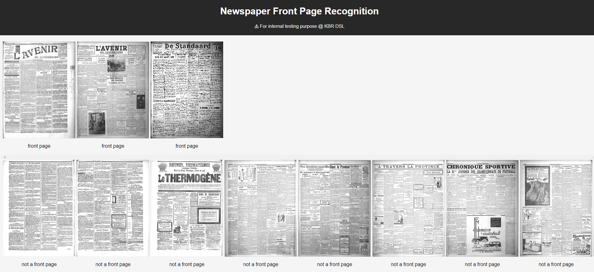

# newspaper-front-page-recognition
## Introduction
Recognizing front pages of historical newspapers. The model operates to output 0 (non-front page) or 1 (front page) on an input image (which is supposed to be an historical newspaper page). The newspapers that are used for training are part of the [*BelgicaPress*](https://www.kbr.be/en/belgica-press/) collection which is hosted and published by the [**Royal Library of Belgium (KBR)**](https://www.kbr.be/en/). The language used in these newspapers are mainly French and Dutch. 
## Backbone
The backbone of the model is [ResNeSt](https://github.com/zhanghang1989/ResNeSt). We used a pretrained version *resnest50_fast_1s4x24d*, please refer to the orignial publication of the authors for further details as well as access to pretrained models. The ending FC layer of the orignial ResNeSt is replaced with a convolutional layer, before further connecting to a classifer (simple combination of one convolutional layer and one FC layer). The code is written on top of the framework published with [CyclGAN](https://github.com/junyanz/CycleGAN). 
## Training and Perforamnce
### Version 0 (current version)
The model is trained using 8 different newspaper titles in the year of 1923. For each title 8 months are chosen randomly for training while the remaining 2 months are used for testing. The accuracy of the model (in terms of bAccuracy and F1) is above 99%.

| Title  | Train (Month) | Train (Pages) | Test (Month) | Test (Pages) | F1 | bAccuracy |
| ------------- | ------------- | ------------- | ------------- | ------------- | ------------- | ------------- |
| Vooruit (Dutch) | 1, 2, 5, 6, 7, 8, 9, 10, 11, 12 | 1656 (total) 258 (front page) | 3, 4 | 406 (total) 53 (front page) | 1 | 1 |
| Le XX Siecle  (French) | 1, 3, 4, 5, 6, 7, 9, 10, 11, 12 | 1820 (total) 295 (front page) | 2, 8 | 344 (total) 58 (front page) | 1 | 1 |
| Journal de Bruxelles  (French) | 1, 2, 3, 4, 5, 7, 8, 9, 10, 11| 1180 (total) 295 (front page) | 6, 12 | 236 (total) 59 (front page) | 1 | 1 |
| Het Nieuws van den Dag (Dutch) | 1, 2, 3, 4, 5, 6, 8, 10, 11, 12 | 1572 (total) 255 (front page) | 7, 9 | 332 (total) 52 (front page) | 1 | 1 |
| Vlaanderen (Dutch) | 1, 2, 4, 5, 6, 7, 8, 9, 10, 12 | 344 (total) 43 (front page) | 3, 11 | 64 (total) 8 (front page) | 1 | 1 |
| De Volksgazet (Dutch) | 1, 2, 3, 4, 5, 6, 7, 9, 11, 12 | 1246 (total) 260 (front page) | 8, 10 | 258 (total) 54 (front page) | 0.98 | 0.99 |
| De Standaard (Dutch) | 1, 2, 3, 4, 7, 8, 9, 10, 11, 12 | 1552 (total) 298 (front page) |5, 6 | 318 (total) 59 (front page) | 0.99 | 1 |
| Independence Belge (French) | 1, 2, 3, 4, 5, 6, 7, 8, 10, 12 | 1564 (total) 296 (front page) | 9, 11 | 314 (total) 57 (front page) | 1 | 1 |


## Usage
For training 
```
front_page_recognition.py --dir_data= 'dirction to images of newspaper pages' --test_ratio=0.2
```
For testing
```
front_page_recognition.py --dir_data= 'dirction to images of newspaper pages' --test_ratio=1 --test_epoch=10
```
For running a webpage based demonstrator
parameters in FPRapp_init.py should be adapted according to the conducted training before running the command below
```
FPRapp_init.py
```

